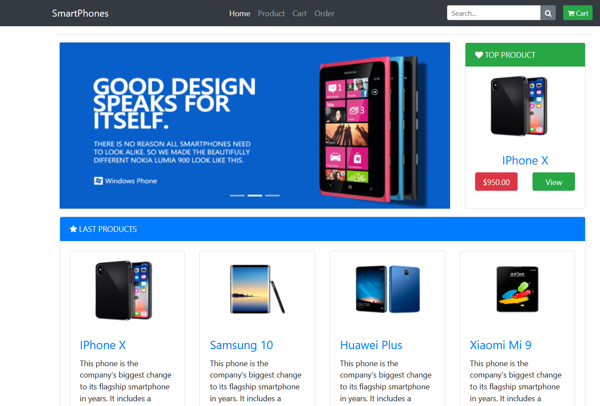

# SmartPhone Shop
It is a web application where people people can purchase smartphones online. It is built using Microservice Architecture and uses Ocleot API Gateway Pattern to consume the varius APis. 

## Built With

- .NET 5
- .NET 6
- ASP.NET Core 5.0
- Docker
- Redis
- MongoDB
- PostgreSQL
- SQL Server
- RabbitMQ
- MassTransit
- Ocelot API Gateway
- AutoMapper
- CQRS
- Dapper

## Live Demo

[Live Demo](https://smartdevphones.com/)



## Getting Started

To get a local copy up and running, follow these simple example steps.

### Prerequisites

- .NET 5
- .NET 6
- Docker: 5.2.3
- Visual Studio 2017 or 2019 

### Setup

Clone the repo


```
git clone https://github.com/kwizl/smartphone-ecom.git
```


We will be running the microservice project in docker. First install Docker Desktop then install WSL2 (Link: https://www.freecodecamp.org/news/how-to-install-wsl2-windows-subsystem-for-linux-2-on-windows-10/). 
Switch docker to linux containers if your are on a windows machine. Make sure **docker-compose** is installed. If you are on a linux machine 
**Fedora**:
```
sudo dnf install docker-compose
```

On Debian and its derivatives:
```
sudo apt install docker-compose
```

Arch Linux users can run:
```
sudo pacman -S docker-compose
```

## Usage

Go to the directory where the docker-compose files are and type:
```
docker-compose -f docker-compose.yml -f docker-compose.override.yml up -d
```

when all containers are running open your browser and go to **http://localhost:8009**

## Acknowledgment

This site was originally designed by **Mehmet Özkaya**. It is under the **Creative Common License**

## Authors

👤 **Martin Njoroge**

- Github: [@kwizl](https://github.com/kwizl)
- Twitter: [@NjoroKaris](https://twitter.com/NjoroKaris)
- Linkedin: [martin njoroge](https://www.linkedin.com/in/martinkariukinjoroge/)

## 🤝 Contributing

Contributions, issues, and feature requests are welcome!
